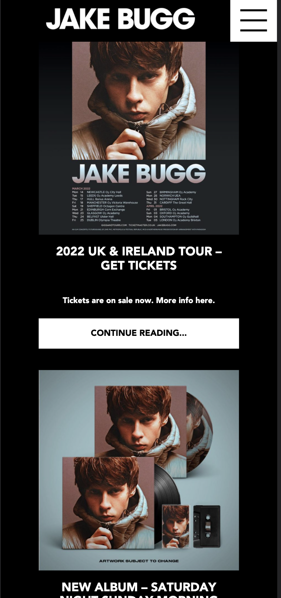
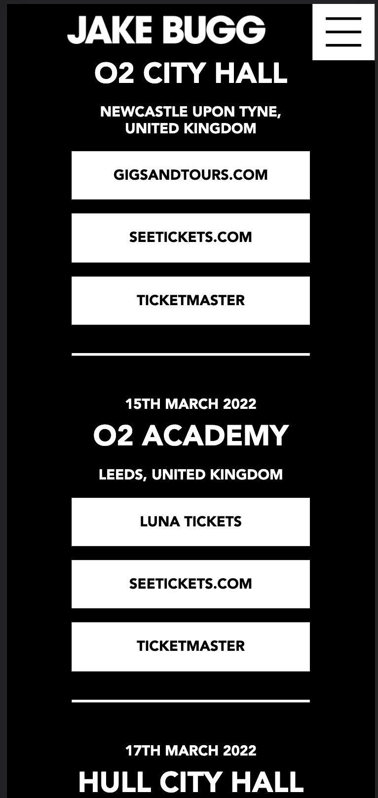
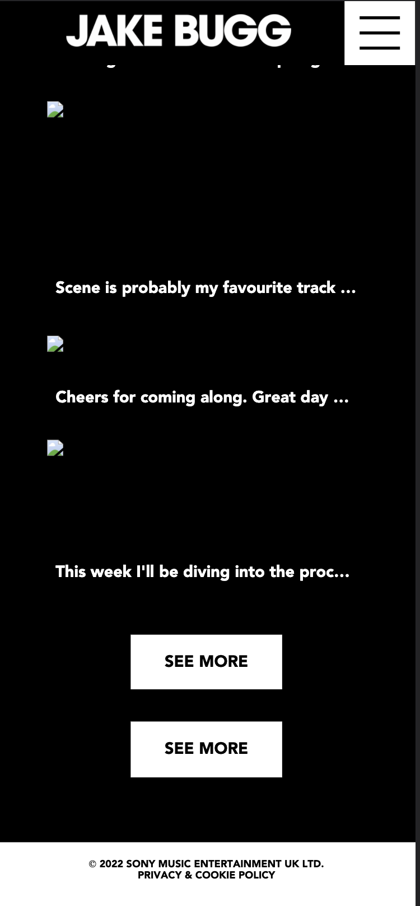
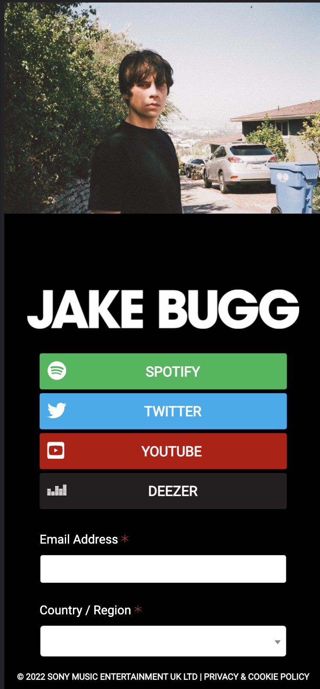
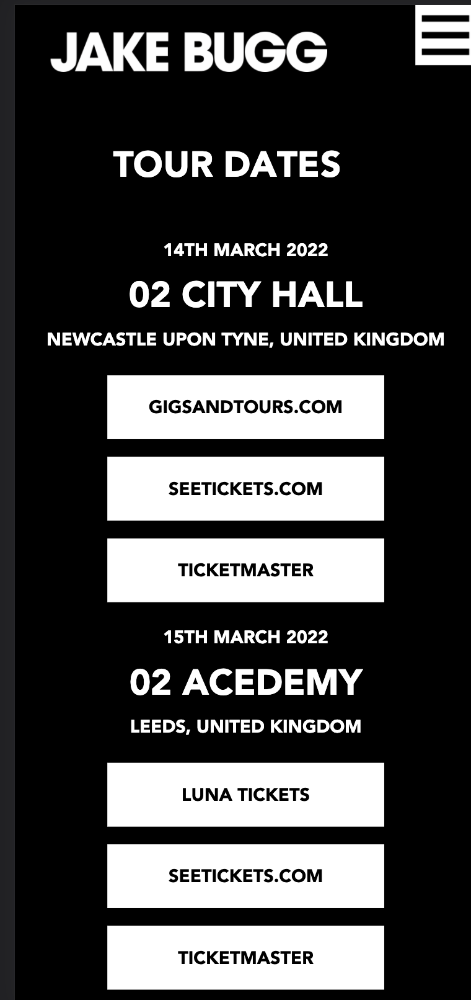
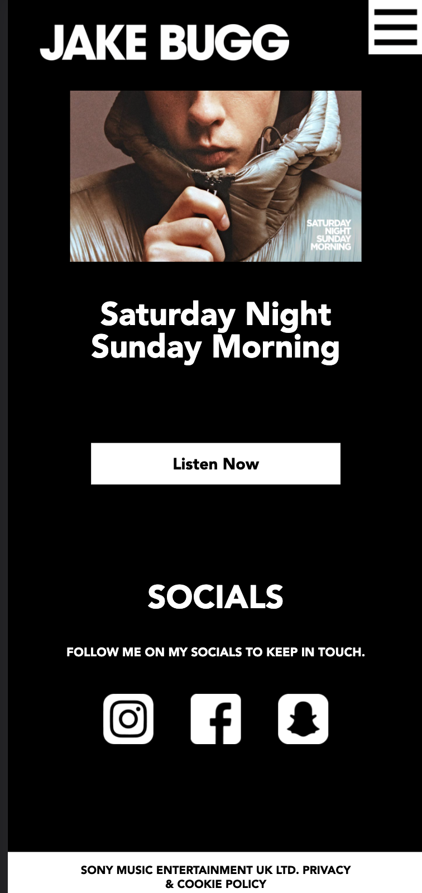
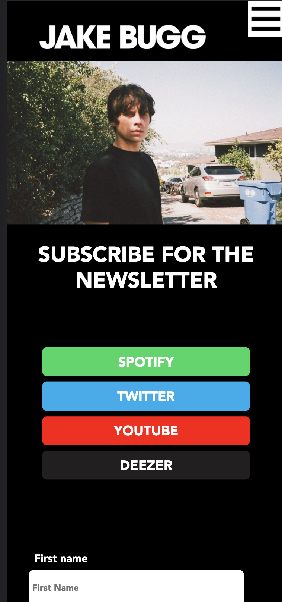
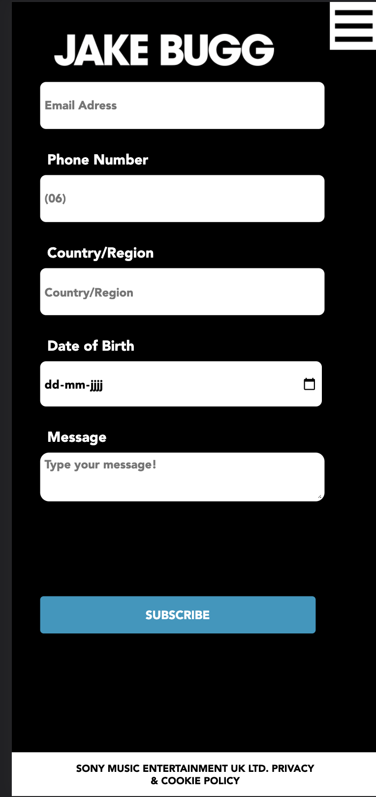

# Procesverslag
Markdown is een simpele manier om HTML te schrijven.  
Markdown cheat cheet: [Hulp bij het schrijven van Markdown](https://github.com/adam-p/markdown-here/wiki/Markdown-Cheatsheet).

Nb. De standaardstructuur en de spartaanse opmaak van de README.md zijn helemaal prima. Het gaat om de inhoud van je procesverslag. Besteedt de tijd voor pracht en praal aan je website.

Nb. Door *open* toe te voegen aan een *details* element kun je deze standaard open zetten. Fijn om dat steeds voor de relevante stuk(ken) te doen.

## Jij

uitwerken voor kick-off werkgroep

### Auteur:
Rick Veerman

#### Je startniveau:
Blauw

#### Je focus:
Surface plane
 

## Je website

uitwerken voor kick-off werkgroep

### Je opdracht:
https://www.jakebugg.com/

#### Screenshot(s) van de eerste pagina (small screen): 
Home screen

#### Screenshot(s) van de tweede pagina (small screen):
Newsletter

#### Screenshot(s) van het hamburgermenu (small screen):

 

## Voortgang 1 (week 2)

uitwerken voor 1e voortgang

### Stand van zaken
Ik loop nog best wel veel achter maar ben wel bezig met het maken van alle oefeningen zodat ik wel snel nieuwe dingen aanleer en weet waar er over gepraat wordt.

### Agenda voor meeting
samen met je groepje opstellen

### Verslag van meeting

- Probeer alle oefeningen te maken 
- Lees de theorie
- Probeer een start te maken

## Voortgang 2 (week 3)

uitwerken voor 2e voortgang

### Stand van zaken

In week 3 besloot ik alles anders te gaan aanpakken, de site die ik oorspronkelijk wilde doen (PicNic) heb ik laten vallen. Dit heb ik gedaan omdat PicNic veel hetzelfde was en er niet goed genoeg uitzag ook inspireerde me dit niet veel omdat ik niks met het merk heb. Toen ben ik een andere site gaan bouwen namelijk de site van Jake Bugg, hij is een van mijn favoriete artiesten dus gaf me dit veel motivatie.

### Verslag van meeting
Ik moet verder gaan waar ik mee bezig ben zodat ik het vak nog bij ben. Mijn eerste pagina zit al een goede start in.

- Werk vooral verder
- Kijk nog even naar je focus

## Toegankelijkheidstest (week 4)

uitwerken na test in 8e voortgang

### Bevindingen
Lijst met je bevindingen die in de test naar voren kwamen:

#### Voice over
De voice over leest veel continue reading maar zegt dan wel de kop van waar de continue reading van is. Kan voor de gebruiker vervelend worden maar is wel duidelijk begrijpbaar.
De Headings worden duidelijk voorgelezen en er is een structuur tussen de H2 en H3’s

#### Toetsenbord en muis 
Met de tabtoets ga je goed door de knoppen heen en worden alle knoppen behandeld alleen de social media iconen niet. Dit komt doordat ze alleen maar images zijn.

#### Diabetes Bril 
Alles valt duidelijk te zien ondanks dat je ziet in vlekken valt alles duidelijk te zien.

#### Ballon
Tekst valt goed te zien omdat de H2’s best groot zijn ook is er een duidelijk contrast dus kun je zien waar je zit op de pagina. 

#### Blur
De tekst valt niet te lezen alleen als je echt dichtbij zit maar omdat alles ingedeeld is in kopjes, buttons en plaatjes zie je wel waar je ongeveer bent maar het blijft nog steeds heel moeilijk.

#### Heinfield Loss
Je ziet alles nog heel duidelijk alleen ben je soort van blind aan de zijkanten van je gezicht wanneer je recht naar de site staart zie je alles net als normaal.

#### Sepasme/ Parkinson
Scrollen gaat goed, de knoppen zijn ook goed bereikbaar omdat er veel ruimte is tussen de secties maar ook zijn de knoppen groot genoeg. Dus alles is goed bereikbaar en misklikken is bijna niet mogelijk.

## Voortgang 3 (week 4)

uitwerken voor 3e voortgang

### Stand van zaken
Ik moet nog wat aanpassen zodat het nog beter toegankelijk is voor elke gebruiker, zoals kleur geven als er met tab gescrold wordt.

### Verslag van meeting
hier na afloop snel de uitkomsten van de meeting vastleggen

- Alles ziet er goed uit
- Paar kleine aanpassingen
- Readme meer opstellen

## Eindgesprek (week 5)

uitwerken voor eindgesprek

### Stand van zaken
Het project vond ik heel leuk en uitdagend maar er gingen jammer genoeg ook veel dingen mis. De eerste 2 weken heb ik een site uitgewerkt die voor mij niet veel betekende, gelukkig ben ik toen over gegaan naar een nieuwe site. 

Met het maken van de nieuwe site (JakeBugg.com) had ik veel plezier en het ging ook vrij snel voor mij gevoel.

De toegankelijk testen waren echt heel leerzaam zoe kruip je in iemand anders zijn huidd en ik heb het gevoel dat ik hier heel veel van geleerd heb.

Bij het inleveren ging het fout mijn github werkte blijkbaar niet en kon dus niet beoordeeld geworden.

In de weken tussen de oplevering en de herkansing ging er veel fout. Ik kreeg even een motivatie dip, heb lang ziek in quarantaine gezeten. En nu zit ik met een amandelonsteking waarbij ik niet kan praten en te ziek ben om naar het scherm te kijken.

Hopelijk heeft dit allemaal niet mijn eindoplevering veel veranderd, maar dit is wel de rede dat er geen extra toevoegingen zijn na de feedback.

### Screenshot(s)

## Bronnenlijst

continu bijhouden terwijl je werkt

1. FED21/22- Animaties - Oefening 1

